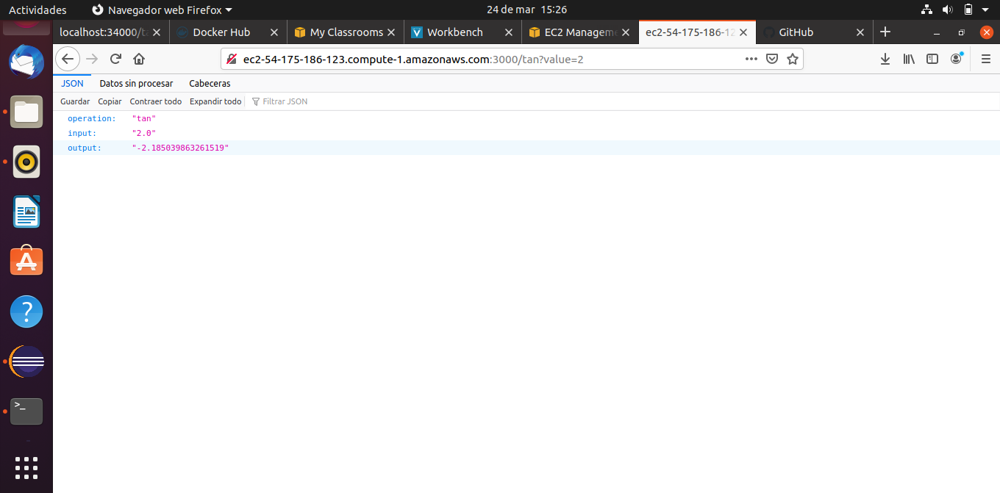
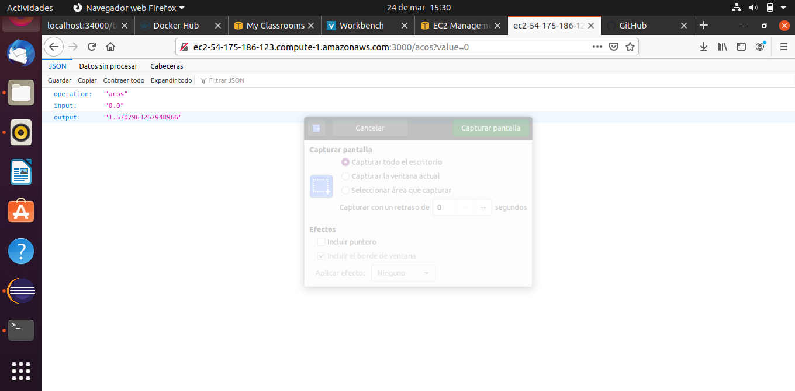

#JOHANN STEVEN BOGOTA VELEZ

# Parcial Segundo tercio AREP
## Descripción
Se construyó un servicio en un microcontenedor docker que fue desplegado en una instancia de EC2 de AWS, en este ejercicio se utilizaron dos funciones matematicas que funcionan como la principal objetivo: tan y acos, y cada una de estas funciones reciben 1 parametro Double y retorna 1 parametro Double. El servicio retornara un objeto JSon con tres claves

## Ejecución
Para la correrlo en EC2 debemos tener una imagen de nuestra aplicacion cargada en docker Hub, lo siguiente que debemos hacer es crear una instancia EC2 que contenga docker, ahí traeremos la imagen del repositorio docker y la ejecutaremos.
Cuando la ejecutamos colocamos el puerte por donde lo queremos exponer y por lo tanto este mismo puerto es el que debemos colocar en los grupos de seguridad de nuestra maquina AWS

## Pruebas
Tenemos una maquina corriendo en AWS y un servicio expuesto en el puerto 3000, para utilizar el servicio debemos colocar en la URL el recurso /{nombre_funcion}?value={numero}
Funcion tan:

Esto nos devolvera el objeto JSon con el resultado de la operación

La misma operación la hacemos a la funcion acos:

